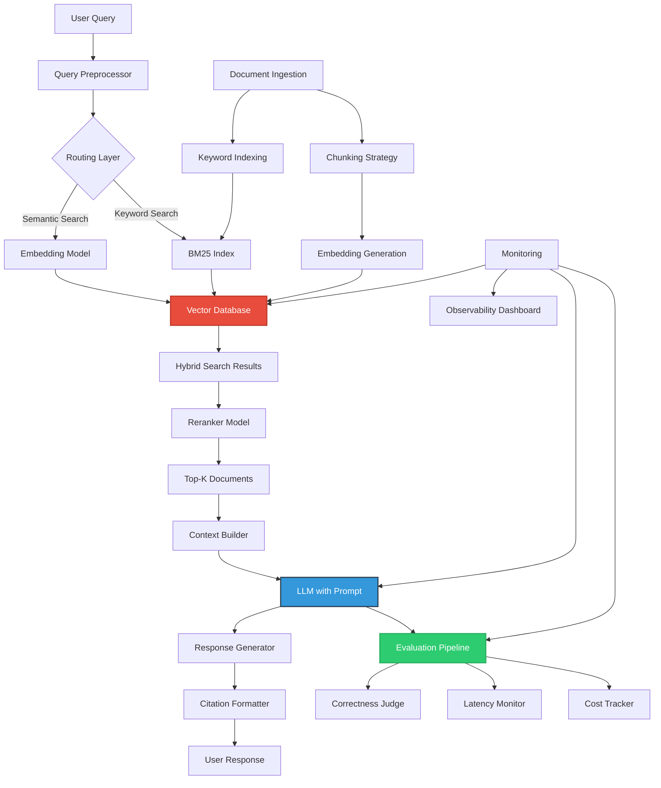
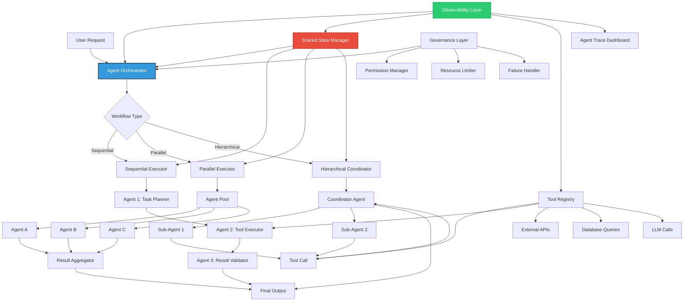
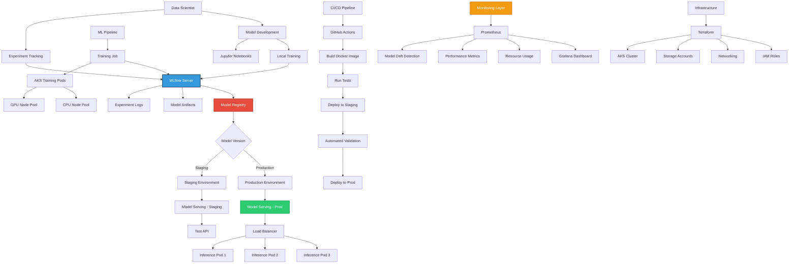

# Architecture Notes

> Architectural patterns and design principles I follow when building production AI systems.

---

## 1. RAG in Production Architecture

### Key Components

**Ingestion Pipeline:**
- **Chunking Strategy:** Recursive character splitter with semantic boundaries (paragraphs, sentences)
- **Embedding Model:** OpenAI `text-embedding-3-small` (cost-effective) or domain-specific fine-tuned model
- **Vector Database:** Azure AI Search, Pinecone, or Weaviate (choice depends on cloud, scale, features)
- **Keyword Index:** BM25 for exact matches (technical terms, IDs, dates)

**Retrieval Layer:**
- **Hybrid Search:** 70% semantic + 30% keyword (tuned per use case)
- **Reranker:** Cross-encoder model (e.g., `ms-marco-MiniLM`) for top-10 → top-3 refinement
- **Query Routing:** Simple queries → keyword, complex queries → semantic, hybrid for everything else

**Generation Layer:**
- **LLM:** Azure OpenAI GPT-4 or GPT-3.5 (cost vs. quality trade-off)
- **Prompt Engineering:** System prompt with role, retrieved context, citations requirement, guardrails
- **Caching:** Prompt caching for repeated queries (40% cost reduction in practice)

**Evaluation Pipeline:**
- **Correctness:** LLM-as-judge + human labeling for critical queries
- **Latency:** p50, p95, p99 tracking with alerts
- **Cost:** Token usage per query, monthly budget tracking
- **Retrieval Quality:** Recall@K, precision@K, NDCG

**Observability:**
- **Traces:** LangSmith or Application Insights for request flow
- **Metrics:** Prometheus for latency, cost, error rates
- **Logs:** Audit logs for compliance, query logs for debugging

### Design Principles
1. **Hybrid beats pure semantic** – Keyword search catches exact matches that embeddings miss
2. **Reranking is worth the latency** – 100ms reranking improves accuracy by 15%+
3. **Citations are non-negotiable** – Users don't trust answers without sources
4. **Evaluation is continuous** – Accuracy degrades over time; monitor and retrain

---

## 2. Agentic Workflow System Architecture

### Key Components

**Orchestration Layer:**
- **Workflow Engine:** LangGraph for state management and control flow
- **Execution Modes:** Sequential (chain of thought), Parallel (independent tasks), Hierarchical (manager-worker)
- **State Management:** Redis for shared memory, PostgreSQL for persistent state

**Agent Pool:**
- **Agent Types:** Task Planner, Tool Executor, Validator, Coordinator
- **Agent Registry:** YAML definitions with capabilities, permissions, resource limits
- **Dynamic Loading:** Agents loaded on-demand from registry

**Tool Layer:**
- **Tool Registry:** Centralized catalog of available tools (APIs, databases, LLMs, custom code)
- **Tool Calling:** Function calling with input validation and output parsing
- **Error Handling:** Retry logic, fallbacks, circuit breakers

**Governance:**
- **Permissions:** Agent-specific access controls (which tools, which data)
- **Resource Limits:** Max tokens per agent, max execution time, max cost
- **Failure Handling:** Graceful degradation, human-in-the-loop escalation

**Observability:**
- **Traces:** LangSmith for agent decision logs, tool calls, state transitions
- **Metrics:** Agent success rate, latency, cost per workflow
- **Dashboards:** Real-time monitoring of active workflows, bottlenecks, failures

### Design Principles
1. **State is king** – Explicit state management prevents agent confusion
2. **Tools over prompts** – Well-defined tools beat "just ask the LLM to do it"
3. **Observe everything** – Agents are black boxes; traces make them debuggable
4. **Fail gracefully** – Agents will fail; plan for retries, fallbacks, human escalation

---

## 3. MLOps Platform Architecture

### Key Components

**Experiment Tracking:**
- **MLflow Server:** Centralized tracking for experiments, parameters, metrics, artifacts
- **Integration:** Python SDK for logging, UI for browsing experiments
- **Storage:** Azure Blob Storage for artifacts, PostgreSQL for metadata

**Model Registry:**
- **Versioning:** Semantic versioning (v1.0.0, v1.1.0, etc.)
- **Stages:** Development → Staging → Production
- **Metadata:** Model lineage, training data, hyperparameters, performance metrics

**Training Infrastructure:**
- **Kubernetes Jobs:** On-demand training pods with GPU/CPU resource requests
- **GPU Node Pool:** NVIDIA T4/V100 for deep learning training
- **CPU Node Pool:** Standard VMs for preprocessing and feature engineering
- **Auto-scaling:** Scale up during training, scale down when idle

**Model Serving:**
- **Deployment:** Docker containers with model artifacts, FastAPI for REST API
- **Scaling:** Horizontal pod autoscaling based on request rate
- **Load Balancing:** NGINX Ingress with sticky sessions for stateful models
- **Versioning:** Blue-green deployments for zero-downtime updates

**CI/CD Pipeline:**
- **Trigger:** Git push to `main` branch
- **Steps:** Lint → Unit Tests → Build Docker Image → Deploy to Staging → Validation Tests → Deploy to Production
- **Rollback:** Automatic rollback if validation fails
- **Notifications:** Slack alerts for deployments and failures

**Monitoring:**
- **Model Drift:** Statistical tests on input distributions (KS test, PSI)
- **Performance:** Latency (p50, p95, p99), throughput (requests/sec), error rate
- **Resource Usage:** CPU, memory, GPU utilization per pod
- **Alerts:** PagerDuty integration for critical issues

**Infrastructure-as-Code:**
- **Terraform:** Provision AKS cluster, storage accounts, networking, IAM
- **Helm Charts:** Deploy MLflow, Prometheus, Grafana, model serving
- **GitOps:** All infrastructure changes via Git PRs

### Design Principles
1. **Everything is code** – Models, infrastructure, pipelines all version-controlled
2. **Automate validation** – No manual testing; automated tests gate production
3. **Monitor everything** – Drift, performance, cost—all tracked in real-time
4. **Make rollbacks trivial** – Production issues happen; fast rollback saves the day

---

## Common Patterns Across Architectures

### 1. **Observability First**
Every system has traces, metrics, and logs. Debugging production AI is impossible without observability.

### 2. **Infrastructure-as-Code**
All infrastructure provisioned via Terraform/Helm. No manual changes to production.

### 3. **Cost Visibility**
Every component tracks cost (LLM tokens, GPU hours, storage). Monthly budgets with alerts.

### 4. **Graceful Degradation**
Systems degrade gracefully under load or failure. Fallbacks, retries, circuit breakers.

### 5. **Security by Default**
Auth, encryption, audit logs, least-privilege IAM. Security is not an afterthought.

---

## Want to Discuss Architecture?

These diagrams are starting points. Real systems are messier, with trade-offs specific to your use case. If you want to dive deeper into any of these patterns, [let's talk](mailto:lrussobertolez@gmail.com).
